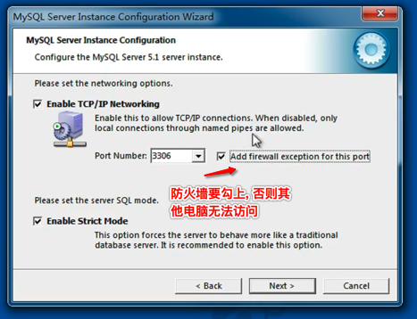

# 数据库

## 一、概述

### 1、数据库知识点

- 数据库的相关概念
- MySQL安装与使用
- navicat 使用(重点)
- SQL 语句的使用(重点)
- 高级


### 2、 RDBMS 

> Relational Database Management System 
> 关系型数据库系统
> 通过表来表示关系

- **数据库的排名:**
   

- **关系型数据库的主要产品:**
  - Oracle: 在以前大型项目中使用, 银行、电信等项目
  - mysql: web时代使用最广泛的关心型数据库
  - microsoft Sql Server : 在微软的项目中使用
  - sqlite: 轻量级的数据库, 主要应用在移动平台


# 二、SQL

 > Structure Query Language 结构化查询语言

 在数据库中进行操作的语言, 称为sql(结构化查询语言).当前的关系型数据库都支持sql 语言进行操作, 也就是说可以通过sql 操作 **Oracle、mySql、ms sql server、 sqlite** 等等的关系型数据库

 - **sql 语言主要分为: **
     - **DQL: 数据查询语言**, 用于对数据进行查询, eg: select
     - **DML: 数据操作语言**, 对数据进行增 删 改, eg: insert、delete、 update
     - **TPL: 事物处理语言**,对事物进行处理,包括begin 、transaction、commit、rollback
     - **DCL: 数据控制语言**, 进行授权与权限回收,如 : grant、revoke
     - **DDL: 数据定义语句**,进行数据库、表的管理等,如: create、drop
     - **CCL: 指针控制语句**, 通过控制指针完成表的操作,如: declare cursor

 **SQL 是一门特殊的语言,专门用于访问操作数据库, 不区分大小写**


# 三、MySQL

## 1、MySQL  简介

MySQL 是一个关系型数据库管理系统, 由瑞典MySQL AB公司开发, 后来被Sun 公司收购, sun 公司后来又被Oracle公司收购, 目前属于Oracle 公司旗下产品.

> 开源 免费 使用范围广 支持多平台
> 是学习数据库开发的首选


## 2、MySQL的特点

- 使用C/ C++编写, 并使用了多种编译器进行测试, 保证源代码的可移植性.
- 支持多种操作系统, 如: Linux、Windows、MacOS等
- 为多种语言提供API, 如: C/C++/python/java等
- 支持多线程, 充分利用CPU资源
- 优化的SQL查询算法, 有效的提高查询速度
- 提供多语言支持, 场景的编码如: GB2312、BIG5、UTF8
- 提供TCP/IP、ODBC和JDBC等多种数据库连接途径
- 提供用户管理、检查、优化数据库操作的管理工具
- 大型的数据库, 可以处理拥有上千万条记录的大型数据库
- 支持多种存储引擎
- MySQL 软件采用了双授权政策, 它分为社区版和商业版, 由于其体积小、速度快、总体拥有成本低,尤其是开放源代码这一特点, 一般中小型网站的开发都选择MySQL 作为网站数据库.
- MySQL使用标准的SQL数据语言形式
- MySQL 可以是定制的, 采用了GPL 协议, 你可以修改源代码来开发自己的MySql系统.


## 3、 windows平台MySQL 安装

### 1、软件的安装

 


 

<br> 
<br> 
<br> 


### 2、服务的操作 (启动/ 停止/ 重启) 


 
 <br>
 在任务管理器查看安装的mysql 服务
 
 <br>
 任务管理器中,操作服务(启动/停止/ 重启)
 
 <br>
 控制面板中查看当前电脑的所有的服务
 
 <br>
 在控制面板中找到对应的服务 (启动/ 停止/ 重启服务)
 


 **3 mySql 服务的连接使用**

 - windows mysql 命令终端
    
    <br>
 - navicat 客户端的使用(通常使用这个)

  


# 四、SQL语句实践

 **SQL 是一门特殊的语言,专门用于访问操作数据库, 不区分大小写**


## 1、创建表

- 格式:

  ```sql
  create table 表名(
    字段名 类型 约束,
  	字段名 类型 约束
  );
  ```

- 示例:

  ```sql
  // 比如:
  // id 无符号 主键 自动增长
  // name 字符串 最长255个字符
  // age 无符号
  // height 小数 最多3位整数 2位小守护
  
  create table student(
  	id int unsigned primary key auto _increment,
    name varchar(25),
    age int unsigned,
    height decimal(5,2)
  );
  ```

  

## 2、删除表

- 格式:

  ```sql
  // 格式1 (如果表不存在会报错)
  drop table 表名
  
  // 格式2 
  drop table if exists 表名
  ```

- 示例

  ```sql
  drop table if exists student;
  ```

- 官方创建表的做法

  ```sql
  drop table if exists student;
  
  create table student (
  	id int unsigned primary key auto_increment,
    name varchar(25),
    age int unsigned,
    height decimal(5,2)
  );
  ```


## 3、插入数据

- 数据库中表的大概样子

  | id (int 主键 自动增长) | name (varchar) | age (int) | height (decimal) |
  | ---------------------- | -------------- | --------- | ---------------- |
  |                        |                |           |                  |

### 1、方式1

- 格式:

  ```sql
  insert into 表名 values(value1, value2, value3, value4);
  ```

- 示例:

  ```sql
  // 1. value 的顺序 和 个数不能乱
  // 2. 如果是 varchar 类型, 需要使用单引号包裹
  // 3. 因为id 是自动增长, 因此我们在插入时使用默认值占位即可, 系统会自动替换为正确的值(常用占位值: 0/ default/ null)
  
  insert into student(0, 'zhangsan', 18, 1.4);
  insert into student(default, 'lisi', 19, 1.99);
  insert into student(null, 'wangwu', 26, 1.88);
  ```

  

### 2、方式2

- 格式

  ```sql
  // 插入那些字段, 字段的值是什么, 这种方式比较灵活
  insert into student(name, age, height) values('zhangsan', 14, 1.66);
  ```

  

### 3、方式3

一次插入多条语句

```sql
insert into student(name, age) values('张三', 18);
insert into student(name, age) values('李四', 19);
insert into student(name, age) values('王五', 20);

// 等价于
insert into student(name, age) values('张三', 18), ('李四', 19),('王五', 20);
// 这种效率高
```


## 4、修改数据

- 格式

  ```sql
  update 表名 set 列1=值1, 列2=值2, ... where 条件
  ```

- 示例

  ```sql
  // 修改满足条件的所有记录
  update student set name='王二麻子' where id>5;
  
  // 没有where 条件, 那么表示修改所有的记录
  update student set age = 28;
  ```


## 5、删除数据

- 格式

  ```sql
  delete from 表名 where 条件;
  ```

- 示例

  ```sql
  delete from student ; // 删除所有记录
  
  delete from student where age = 18;
  ```

  

## 6、查询数据


### 1、简单的查询记录

```sql
select 字段名1, 字段名2 ... from 表名 where 条件;

select * from 表名 where 条件; // * 字段通配符, 表示所有字段
```


### 2、给查询字段取别名

- **方式1(推荐)**

```sql
// 推荐
select name as 姓名, age as 年龄, height as 身高 from student where age < 18;
```


- **方式2**

省略 **as**  效果一样

```sql
select name  姓名, age  年龄, height 身高 from student where age < 18;
```


### 3、给查询的表取别名

```sql
// 给表取别名, 一般在多张表一起查询时取别名好记(便于记忆)
select name, age, from student as stu; 

// 表示查询别名 为 stu 这张表里面的name 和 age
select stu.name, stu.age from student as s;
```


### 4、查询记录, 并对查询结果去重

  

- 单个字段去重

  ```sql
  // 表示查询小于18的学生有几个性别
  select distinct sex from student where age < 18; // 单个字段去重
  ```

- 多个字段去重

  ```sql
  select distinct sex, class from student where age < 20;
  
  // 如: 没去重前的数据为
    性别  班级
    女    1班
    男    1班
    女    2班
    男    2班
    女    1班
    男    1班
    女    2班
    男    2班
  
    去重后: (表示的是去除相同的记录)
    女    1班
    男    1班
    女    2班
    男    2班 
  
    select distinct * from student where age < 20;
  ```

> `distinct`  表示的是去除重复的记录


### 5、条件查询

#### 1、条件查询简介

使用 **where** 子句对表中的数据筛选, 符合条件的数据会出现在结果集合中

- where 后面支持多种运算符, 进行条件的处理
  - 比较运算
  - 逻辑运算
  - 模糊查询
  - 范围查询
  - 空判断

#### 2、语法

```sql
select 字段1, 字段2, ... from 表名 where 条件;

// 比如:
select * from student where id = 1;

```

#### 3、比较运算符介绍

- **等于:** `=`
- **大于:** `>`
- **大于等于:** `>=`
- **小于:** `<`
- **小于等于:** `<=`
- **不等于:** `!= 或 <>`

#### 4、逻辑运算符介绍

- **逻辑与:** `and`
- **逻辑非:** `not`
- **逻辑或:** `or`


#### 5、简单的查询示例

- 查询年龄小于20的女生

  ```sql
  select * from student where age < 20 and sex='女';
  ```

- 查询女生 或 1班的学生

  ```sql
  select * from student where sex='女' or class='1班';
  ```

- 查询非天津的学生

  ```sql
  select * from student where not hometown='天津';
  或
  select * from student where hometown!='天津';
  或
  select * from student where hometown<>'天津';
  ```

  

#### 6、模糊查询(重点)

模糊查询的使用范围很广, 一般用于搜索

##### 1、匹配(包含)查找


- **like** 关键字

  - `%`: 表示任意多个任意字符
  - `_` : 表示一个任意字符

  > **注意:**
  >
  > 模糊查询`like` 关键字必须和`%` 或者 `_` 结合起来使用

​	

- 示例:

  - 查找 `张*星` 的人

    ```sql
    select * from student where name like '张_星`;
    ```

  - 查询所有姓 张的人

    ```sql
    select * from student where name like '张%'; 
    ```

  

#### 7、范围查找

- **常用的关键字** 
  - **in**: 表示在一个非连续的范围(集合)内
  - **between ... and ...**: 表示在一个连续的范围内


- 使用 **in** 查询, 示例

  例1: 查找家乡是北京 或 上海 或 广东的学生

  ```sql
  select * from student where hometown in ('上海', '北京', '广东');
  或
  select * from student where hometown='上海' or hometown='北京' or hometown='广东';
  ```


- 使用 **between ... and ...** 示例

  例2: 查询年龄为18 至 20 的学生

  ```sql
  select * from student where age between 18 and 20;
  或
  select * from student where age>=18 and age <=20;
  ```

  > 注意:
  >
  > between 18 and 20, 不能写成 between 20 and 18, 必须小的在左边大的在右边

  


#### 8、空判断

在数据库中使用 `null` 与 使用`''` 是不同的


##### 1、判断空和非空


- **判断空:** `is null`
- **判断非空:** `is not null`


- 判空示例

  例1: 查询没有填写身份证的学生

  ```sql
  select * from student where cardId is null;
  ```

  例2:

  查询, 身份证号为'空'的学生, **和 null 不是一回事**

  ```sql
  select * from student where cardId='';  // null 表示未填写, '' 表示填了填写为空
  ```

  例3:

  查询填写了身份证的学生

  ```sql
  select * from student where cardId is not null;
  ```

  > 注意:
  >
  > 如果你要查询一个字段为`null` 的记录, 只能用 `is null` 不能用 `字段名=null`

  

##### 2、数据库中存入空


| id   | name | age  | height | hometown |
| ---- | ---- | ---- | ------ | -------- |
|      |      |      |        |          |


- 方式1: 

  在插入数据时, 指定的字段什么都不写, 默认就是 null

  ```sql
  insert into student(name, age) values('张三', 18);
  // 这样 height 和 hometown 自动就为null 了
  ```

- 方式2:

  在插入的时候, 明确的指明插入的数据就是 null

  ```sql
  insert into student(name, age, height, hometown) values('张三', 18, null, null);
  ```

  

### 6、查询排序

为了方便查看数据, 我们可以对查询到的数据进行排序

- **语法:**

  ```sql
  select * from student order by 列1 asc | desc, 列2 asc | desc ...
  ```

  将数据按照`列1`进行排序, 如果某些`列1`的值相同, 则按照`列2` 排序,  以此类推...

  - 默认情况下 按照列值从小到大排序
  - 升序: `asc`
  - 降序: `desc`

- **示例:**

  例1: 查询所有的学生信息, 按年龄从小到大排序

  ```sql
  select * from student order by age;
  或
  select * from student order by age asc;
  ```

  例2:查询所有学生信息, 按年龄从大到小排序, 年龄相同按照学号从小到大排序

  ```sql
  select * from student order by age desc, stuNo asc;
  或
  select * from student order by age desc, stuNo;
  ```

  > **说明:**
  >
  > sql 在排序时, 如果有多个字段有 排序要求, 会先按照前面的字段先排序, 前面的字段相同才会借助后面的字段排序.

- **中文字段排序**

  例3:

  ```sql
  select * from student order by convert(name using gbk);
  ```

  > **注意:** 
  >
  > 如果是按照中文名字排序, 因为我们使用的是UTF8编码, 所以拍出来的有问题, 如果要按照中文排序, 我们需要将字段内容进行转码


### 7、连接查询(多表查询)!!!

当查询出来的结果源于多张表, 需要将多张表连接成一个大的数据集, 再选择合适的列返回

##### 连接查询介绍


- **等值连接查询**

   

- **左连接查询**

  查询到的结果为两个表匹配到的数据 加 左边表特有的数据, 对于右边表中不存在的数据使用null 填充

   

- **右连接查询**

  查询到的结果为2个表匹配到的数据加上右边表特有的数据, 对于左边表中不存在的数据使用null 值填充

   


##### 1、等值连接查询

- **方式1:**

  ```sql
  select * from 表1, 表2 where 表1.列=表2.列;
  ```

- **方式2:** 又称为内连接**(推荐)**

  ```sql
  select * from 表1
  inner join 表2 on 表1.列=表2.列
  ```

  例1: 查询学生表信息及学生的成绩

  ```sql
  select 
  	* 
  from
  	student as stu, scores as sc
  where
  	stu.studentNo = sc.studentNo
  	
  ------------------------------------------
  select 
  	* 
  from 
  	student as stu
  inner join scores as sc 
  on
  	stu.studentNo = sc.studentNo;
  ```

  例2: 查询课程信息 及 课程成绩

  ```sql
  select 
  	* 
  from 
  	courses as cs, scores as sc
  where
  	cs.courseNo = sc.courseNo;
  	
  ---------------------------------------
  select 
  	* 
  from 
  	courses as cs
  inner join scores as sc 
  on cs.courseNo = sc.courseNo;
  ```

  例3: 查询学生信息 及 学生的课程对应的成绩

  ```sql
  select 
  	* 
  from 
  	student, courses, scores
  where
  	student.studentNo = courses.studentNo and courses.courseNo = scores.courseNO;
  	
  -----------------------------------------
  // 使用内连接来写, 就必须注意表之间的链接顺序
  select 
  	*
  from student
  inner join courses on student.studentNo=courses.studentNo
  inner join scores on courses.courseNO=scores.courseNo;
  ```

  > **注意:** 等值连接的两种方式是有差异的
  >
  > - `select * from 表1, 表2 where 表1.列=表2.列;` 方式会产生笛卡尔积, 然后在过滤, 内存开销要大些
  > - `select * from 表1 inner join 表2 on 表1.列=表2.列;`  会判断是否满足条件在链接,内存开销要小些.

  **内连接相较于 where查询, inner join 是有顺序关系的**

 

- **链接查询后 过滤**

  例子:  查询'王昭君' 的数据库成绩, 要求显示姓名\ 课程\成绩

  ```sql
  select
  	*
  from
  	student, courses, scores
  where
  	student.studentNo = courses.studentNo and courses.courseNo=scoresNo
    and student.name = '王昭君'
    and courses.name = '数据库';
  ```


##### 2、左连接

左连接代表的是左边的表, join 前边的表相对于后边的表就是左表

左连接的特点是, 把左边的表全部显示出来, 右边没有数据的记录就以 null 补全

```sql
select 
	* 
from
	表1
left join 表2 on 表1.列=表2.列;
```

例1: 查询所有学生的成绩,包括没有成绩的学生

```sql
select 	
	* 
from
	student as stu
left join scores as sc on stu.studentNo=sc.studentNo;
```

例: 查询所有学生的成绩, 包括没有成绩的学生, 需要显示可能名

```sql
select
	*
from
	student as stu
left join scores as sc on stu.studentNo=sc.studentNo
left join courses as cs on sc.courseNo=cs.courseNo;
```


##### 3、右链接

右连接, 就是把右边的表全部显示出来, 左边没有对应记录的信息, 就用null值填充.


##### 4、左连接、右连接、inner join  综合使用


### 8、子查询

#### 1、介绍

- **子查询:**

  在一个select 语句中, 嵌入了另一个 select语句, 那么被嵌的select语句被称之为子查询语句.

- **主查询:**

  主查询的对象, 第一条select语句

- **主查询 和 子查询的关系:**

  - 子查询是嵌入到主查询中
  - 子查询是辅助主查询的, 要么充当条件, 要么充当数据源
  - 子查询是可以独立存在的语句, 是一条完整的select语句

- **子查询分类:**
  - **标量子查询:** 

    子查询返回的结果是一个数据(一行一列)

  - **列子查询:** 

    返回的结果是一列(一列多行)

  - **行子查询:** 

    返回的结果是一行(一行多列)

  - **表级子查询:** 

    返回的结果是多行多列


#### 2、标量 子查询

例1: 查询班级学生的平均年龄

```sql
// 查询班级学生的平均年龄
select avg(age) from student;

// 查询年龄>20 的学生
select * from student where age > 20;

// 标量子查询
select * from student where age > (select avg(age) from  student);
```

> 特点:
>
> 子查询的结果是 **一行一列**


**注意:**

- 虽然我们使用普通的多条查询语句, 可以实现标量子查询语句 (嵌套查询)的功能, 当是我们不推荐. 因为多条语句在执行时, 有可能语句与语句之间有其它的变化, 数据有风险. 

- 但是我们如果使用的是, 嵌套查询就不会有这样的数据安全风险了.


#### 3、列量 子查询

例1: 查询18岁的学生的成绩, 要求显示成绩

```sql
select * from scores where score.studentNo in (select studentNo from student where age = 18);
```

> 特点:
>
> 子查询返回的结果是1列多行


#### 4、行 子查询

例1: 查询男生中年龄最大的学生信息

```sql
select * from student where sex='男' and age=26;
或
select * from student where (sex,age) = ('男', 26);

// 行子查询
select * from student where (sex, age) = (select sex, age from student order by age desc limit 1) ;
```

> 特点: 
>
> 子查询返回的结果是一行多列


#### 5、表级 子查询

前面讲的 标量 子查询/ 列量 子查询/ 行 子查询, 其查询结构都是作为 where 的条件的.

例:查询数据库和系统测试的课程成绩

```sql
// 方式1: 
select 
	* 
from 
	scores
	inner join courses on scores.courseNo=courses.No 
where courses.name in ('数据库', '系统测试');
// 方式1的缺点, 先查询生成一个大的表, 再将表数据过滤
// 相当于在一大堆数据中再过滤


// 方式2, 把查询出来的记录当成数据源, 必须起别名
select 
	* 
from 
	scores as sc
inner join (select * from courese where name in ('数据库', '系统测试') as cs
on sc.courseNo = cs.courseNo;
    
// 方式2 有点, 数据量小, 效率高
```

> 注意: 
>
> - `select * from 表名`, 这个表名代表的是一个数据源
> - `select * from 表名1 inner join 表名2 on where xxx`,  表名1 和 表名2 都是代表的是数据源

**在sql 语句中除了表名可以代表数据源, 查询到的记录也可以作为数据源.**


#### 6、子查询中特定关键字使用

- **in:** 范围

  ```sql
  // 格式:
  主查询 where 条件 in (列 子查询);
  ```

- **any | some :**  任意一个(any 和 some 是一样的意思)

  ```sql
  // 格式1:
  主查询 where 列=any(列 子查询);
  
  // 格式2:
  主查询 where 列=some(列 子查询);
  ```

  > 在条件查询的结果中匹配任意一个即可, 等价于 **in**

- **all:**

  ```sql
  主查询 where 列=all(列 子查询); // 等于里面所有
  主查询 where 列<>all(列 子查询); // 不等于其中所有
  ```


----------

```sql
select * from student where in (select age from student where age between in and 20);

// =any 相当于in
select * from student where =any(select age from student where age between 18 and 20);

// =some 相当于in
select * from student where =some(select age from student where age between 18 and 20);

// > any 相当于大于其中一个最小的
select * from student where >any(select age from student where age between 18 and 20);

// < any 想当于小于其中一个最大的
selectt * from student where <any(select age from student where age between 18 and 20);

// !=any 没意义(语义没错, 但是不能这么写没意义) 
select * from student where !=any(select age from student where age between 18 and 20);

=all 是没有意义的, 只有大于 小于 != 才有意义
```


 ### 9、子查询演练

准备数据:

```sql
delete table if exists goods;
create table goods(
    id int unsigned primary key auto_increment,
    name varchar(10),
    cate varchar(40),
    brand_name varchar(40),
    price decimal(10,3),
    is_show bit default 1,
    is_saleoff bit default 0
);


insert into goods values
(0, 'r510vc 15.6 英寸笔记本', '笔记本', '华硕','3399',default, default ),
(0, 'y400n 14.0英寸笔记本电脑', '笔记本', '联想','4999',default, default ),
(0, 'q150th 15.6英寸游戏本', '游戏本', '雷神','8499',default, default ),
(0, 'x550cc 15.6英寸笔记本', '笔记本', '华硕','2799',default, default ),
(0, 'x240 超级本', '超极本', '联想','4999',default, default ),
(0, 'u330p 13.3英寸超级本', '超级本', '联想','4299',default, default ),
(0, 'svp13226scb 触控超级本', '超级本', '索尼','7999',default, default ),
(0, 'ipad mini 7.9英寸平板电脑', '平板电脑', '苹果','1998',default, default ),
(0, 'ipad air 9.7英寸平板电脑', '平板电脑', '苹果','2788',default, default ),
(0, ' ', ' ', ' ',' ',default, default ),
(0, ' ', ' ', ' ',' ',default, default ),
(0, ' ', ' ', ' ',' ',default, default ),
(0, ' ', ' ', ' ',' ',default, default ),
(0, ' ', ' ', ' ',' ',default, default ),
(0, ' ', ' ', ' ',' ',default, default ),
(0, ' ', ' ', ' ',' ',default, default ),
(0, ' ', ' ', ' ',' ',default, default ),
(0, ' ', ' ', ' ',' ',default, default ),
(0, ' ', ' ', ' ',' ',default, default ),
(0, ' ', ' ', ' ',' ',default, default ),
(0, ' ', ' ', ' ',' ',default, default ),
(0, ' ', ' ', ' ',' ',default, default ),
(0, ' ', ' ', ' ',' ',default, default ),
(0, ' ', ' ', ' ',' ',default, default ),
(0, ' ', ' ', ' ',' ',default, default ),
(0, ' ', ' ', ' ',' ',default, default ),
(0, ' ', ' ', ' ',' ',default, default ),
(0, ' ', ' ', ' ',' ',default, default ),
(0, ' ', ' ', ' ',' ',default, default ),
(0, ' ', ' ', ' ',' ',default, default ),
(0, ' ', ' ', ' ',' ',default, default ),
```


- 例1:  查询所有价格大于平均价格(保留2位小数)的商品, 并按价格降序排序

  ```sql
  // 查询平均价格 (使用avg() 聚合函数)
  select avg(price) from goods;
  
  // 使用round() 函数, 四舍五入, 这样查出来的结果就没有小数了
  select round(avg(price)) from goods;
   
  // 使用round() 函数, 保留2位小数
  select round(avg(price),2) from goods;
  
  // 最终结果
  select * from goods where price > (select round(avg(price),2) from goods) order by price desc;
  ```

- 例2: 查询类型为 '超级本' 的商品价格

  ```sql
  select * from goods where cate='超极本';
  ```

- 例3: 查询价格大于或等于 '超级本' 价格的商品, 并按价格降序排序

  ```sql
  select * from goods where prince =any(select price from goods where cate='超级本') order by price desc;
  
  // =any 或者 =same 等价于 in
  select * from goods where prince in(select price from goods where cate='超级本') order by price desc;
  
  
  // !=all 等价于 not in
  select * from goods where prince !=all(select price from goods where cate='超级本') order by price desc;
  ```

  

## 7、自关联(巧妙!)

设计省的表结构 **provinces**

| id   | ptitle |
| ---- | ------ |
|      |        |

设计市信息的表结构 **citys**

| id   | ctitle | proid |
| ---- | ------ | ----- |
|      |        |       |

> citys 表的 proid 表示的是城市所属的省, 对应着 provinces表中的id

**问题: **

​	**能不能将两张表合成一张表?** 


**思考: **

​	**观察两张表发现, citys表比provinces表多一个列, 其它的类型都是一样的.**


**意义: **

​	**存储的都是地区信息, 而且每种信息的数据量有限, 没必要增加一个新表, 或者 将来还要存储区、乡镇信息, 都增加新表的开销太大.**


**答案: **

**定义表areas, 结构如下:** 

| id   | title | pid  |
| ---- | ----- | ---- |
|      |       |      |

> - 因为省没有所属的省份, 所以可以填写为 null
> - 城市所属的省份pid, 填写省所对应的编号id

**这就是自关联, 表中的某一列, 关联了表中的另外一列, 但是他们的业务逻辑含义是不一样的, 城市信息的pid 引用的是省信息的id,在这个表中, 结构不变, 可以添加区县、乡镇、村社等信息.**


有很多应用里面的表,其实都是使用的自关联表实现的.如下: 

 


- **示例: 自关联**

  | aid    | atitle   | pid    |
  | ------ | -------- | ------ |
  | 130000 | 河北省   |        |
  | 130100 | 石家庄市 | 130000 |
  | 130400 | 邯郸市   | 130000 |
  | 130600 | 保定市   | 130000 |
  | 130700 | 张家口市 | 130000 |
  | 130800 | 承德市   | 130000 |
  | 410000 | 河南省   |        |
  | 410100 | 郑州市   | 410000 |
  | 410300 | 洛阳市   | 410000 |
  | 410500 | 安阳市   | 410000 |

例1: 查询河南省的所有城市

```sql
// 方式1: 
select * from areas where pid = (select aid from areas where atitle='河南省' and pid is null);

// 方式2:
// 说明: 同一张表在一条sql 语句中可以查询多次, 只要是取别名以示区分
select 
	* 
from
 	areas as sheng,
 	areas as shi
where 
	shi.pid = sheng.aid
	and sheng.atitle = '河南省';
```


例2: 查询所有的省

```sql
// 省份没有 pid
select * from areas where areas.pid is null;
```


## 8、查询插入


### 1、将Sql语句查询到的结果直接插入另一个表中


- **语法:**

  ```sql
  insert into ... select ...
  
  
  // 将 select distinct cate from goods 语句查询的列数据直接插入一个表中
  insert into goodsCate(cate_name) select distinct cate from goods;
  ```


### 2、创建表, 并将查询的数据插入到创建的表中

- **语法:**

  ```sql
  create table ... select ...
  ```

  > 特点:
  >
  > 如果查询出来的数据字段, 在新建的表中有, 就直接插入
  >
  > 如果查出来的数据字段在新建的表中没有, 就会新建一个字段并插入
  >
  > 即: 具体插入那一列, 就看名字是否一样, 不一样就新建字段

  ```sql
  // 一条语句, 直接将查询的数据插入新建的表中
  create table goods_brand(
  	id int unsigned primary key auto_increment,
    brand_name varchar(10)
  )
  select distinct brand_name from goods;
  ```


### 3、直接使用 sql 语句备份一张表

- **语法:**

  ```sql
  create table ... select ...
  
  // 查询到的什么字段就创建字段, 一模一样
  create table goods_bak select * from goods;
  ```

  

### 4、使用一个表的字段更新另外一个表的字段

```sql
// 这个是一般的查询
select 
	*
from
	table goods
inner join goods_cate on goods.cate=goods_cate.cate_name;


// 稍作调整就可以更新了
1> 把前面的 select * from 改为 update
2> 在后面添加要更新的字段

update goods
inner join goods_cate on goods.cate=goods_cate.cate_name
set goods.cate=goods_cate.id;
```


## 9、聚合函数


**为了快速得到统计数据, 经常会用到如下5个聚合函数 (聚合函数不能在 where 中使用)**

- **count(*):** 表示计算总行数
- **max(列):** 表示求此列中的最大值

- **min(列):** 表示求此列中的最大值
- **sum(列):** 表示求此列的和

- **avg(列):** 表示求此列的平均值


例1:查学生总数

```sql
select count(*) from student;
```


例2: 查询女学生的最大年龄

```sql
select max(age) from student where sex='女';
```


例3:查询1班的最小年龄

```sql
select min(age) from student where class='1班';
```


例4: 查询背景学生年龄总和

```sql
select sum(age) from student where hometown='北京';
```


例5: 查询平均年龄

```sql
select avg(age) from student where hometown='北京';
```


说明:

聚合函数也可以同时查询几个值

```sql
select max(age), min(age), avg(age) from student;

// 取别名
select max(age) as maxAge, min(age) as minAge, avg(age) as avgAge from student;
```


## 10、查询练习

1、统计2班男女各有多少人? 

```sql
select sex, count(*) from student where class='2班' group by sex;
```


2、查询现有学生都是来自于那些不同的省份

```sql
select hometown from student group by hometown;
```


3、查询所有的男生, 并按年龄升序排序

```sql
select * from student order by age where sex='男';
```


4、统计共有多少学生

```sql
select count(*) from student;
```


5、统计年龄大于20岁的学生有多少个

```sql
select count(*) from student where age > 20;
```


6、统计男生的平均年龄

```sql
select avg(age) from student where sex='男';
```


7、查1班中, 最大的年龄是多少

```sql
select max(age) from student where class='1班';
```


8、统计每个班级中每种性别的学生人数, 并按班级升序排序

```sql
select class, sex, count(*) from stu group by class, sex order by class;
```


9、查询年龄最小的学生的全部信息

```sql
select * from student order by age limit 1;
```


10、查询学生'张三'的基本信息

```sql
select * from student where name='张三';
```


11、查询学生 '张三' 或 '李四'  的基本信息

```sql
select * from student where name='张三' or name='李四';
```


12、查询姓 '张' 学生的姓名, 年龄, 班级

```sql
select name, age, class from student where name like '张%';
```


13、查询姓名中包含有 `约` 的学生

```sql
select * from student where name like '%约%';
```


14、查询姓名为3个字, 姓 '孙' 的学生学号, 姓名, 年龄, 班级, 身份证号

```sql
select student as 学号, name as 姓名, age as 年龄, class as 班级, card as 身份证
from student where name like '孙__';
```


15、查询姓 '孙' 或者 姓 '百' 的学生基本信息

```sql
select * from student where name like '孙%' or name like '百%';
```


16、查询姓 '百' 且家乡是 '山西' 的学生基本信息

```sql
select * from student where name like '百%' and hometown='山西';
```


17、查询家乡是 '北京'  '新疆'  '山东' 或者 上海的学生

```sql
select * from student where hometown in ('北京', '新疆', '山东', '上海');
```


18、查询姓 '孙' , 但是家乡不是 '河北' 的学生信息

```sql
select * from student where name like '孙%' and hometown!='河北';
```


19、查询家乡不在 '北京' '上海' '成都'的学生

```sql
select * from student where hometown not in ('北京', '上海', '成都');
```


20、查询学生, 并以性别排序

```sql
select * from student order by sex;
```


## 11、分组


### 1、分组介绍

- 按照字段分组, 表示此字段相同的数据会被放到一个组中
- 分组后, 分组的依据列会显示在结果集中, 其它列不会显示在结果集中
- 可以对分组的数据进行统计, 做聚合运算


### 2、分组的使用场景:

- 分组的使用场景一般是用来对元数据进行分类统计, 并显示统计后的数据
- 分组一般都会和我们的聚合喊你书一起配合使用, 统计某个字段值的信息

> 其实, 分组也可以用于去重, 和我们之前讲的 distinct 一样


### 3、语法

```sql
select 列1, 列2, 聚合... from 表名 group by 列1, 列2...
```

例1:  查询各种性别的人数

```sql
select sex, count(*) from student group by sex;

// 取别名
select sex, count(*) as 人数 from student group by sex;
```


例2: 查询各种年龄的人数

```sql
select age, count(*) from student group by age;
```


例3: 查询各个班的平均年龄, 最大年龄, 最小年龄, 人员总数

```sql
select class, avg(age), min(age), max(age), count(age) from student group by class;

// 取别名
select class as 班级名称, avg(age) as 平均年龄, min(age) as 最小年龄, max(age) as 最大年龄
count(age) as 总人数 from student group by class;

```


例4: 查询各班级, 男生, 女生的人数(即, 先按班级分组, 再按性别分组)

```sql
// 多个分组之间使用逗号隔开
select class, sex, count(*) from student group by class, sex;
```


### 4、分组后的数据筛选


**语法** 

```sql
select 列1, 列2, 聚合... from 表名
group by 列1, 列2 列3...
having 列1,... 聚合 ...
```

**having 后面的条件运算符与 where 相同**


例1: 查询男生总人数

```sql
// 方案1: 
select sex count(*) from student where sex='男';

// 方案2:
select sex count(*) from student group by sex having sex='男';

// having sex='男' 表示的就是在分组后再过滤, 相当于 where sex=男
// 但是在分组后面只能使用 having 列=value 不能使用 where
```


例2: 查询1班外其他班级的平均年龄, 最大年龄, 最小年龄

```sql
// 先查询过滤, 再分组
select class, avg(age), max(age), min(age) from student where class!='1班' group by class;

// 先分组, 再过滤
select class, avg(age), max(age), min(age) from student group by class having class !='1班';
```


- **对比 where 与 having** 

  - where 是对 from 后面指定的表进行数据帅选, 属于对原始数据的帅选
  - having 是对group by 对的结果进行帅选

  

## 12、分页


### 1、获取部分分页

当数据量过大时, 在一页中查看数据是一件非常麻烦的事情.


**语法:**

```sql
select * from 表名 limit start, count;

// 从start开始, 获取count 条数据
// start索引从0开始
```


例1: 查询前3条学生信息

```sql
select * from stu limit 0, 3;
```


例2: 查询第4到第6条学生信息

```sql
select * from student start 3, 3;
```


例3: 先排序, 再显示部分 和  直接显示部分是不一样的

```sql
select * from student group by sex limit 0, 3;
```

> 如果分页, 从第0条开始获取, start参数也可以省略

```sql
// 表示的是查询最前面5条数据
select * from student limit 5;

// 等价于
select * from student limit 0, 5;
```


### 2、分页

已知: 每页显示 m 条数据, 求显示第 n 页的数据

```sql
pageCount = 10;
page = 1;
select * from student limit pageCount*page, pageCount;
```


## 13、SQL 数据类型 与 约束

为了更加准确的存储数据, 保证数据的正确有效.需要合理的使用数据类型和约束来限制数据的存储


### 1、常用数据类型

- **整型:** int(4字节) 

  有符号范围(-2147483648~2147483647), 无符号(0~4294967295)对于整数来说,字段设置长度无意义

- **小数:** decimal

  如: decimal(5,2) 表示共存储5位数, 小数占2位,整数占3位

- **字符串:** varchar

  范围(0~65533), 如:varchar(3)表示最多存3个字符, **一个中文或一个字母都占一个字符**

- **日期时间:**datetime

  范围(1000-01-01 00:00:00 ~9999-12-31 23:59:59), 例如: 2020--1-1 12:34:45


### 2、约束


- **主键(primary key):** 物理上的存储顺序
- **非空(not null):** 此字段不允许填写空值
- **唯一(unique):** 此字段的值不允许重复
- **默认值(default):** 当不填写此值时会使用默认值, 如果填写时以填写为准)
- **外键(foreign key):** 维护两个表之间的关联关系


### 3、笛卡尔积

在数据库的 SQL 语句多表查询数据时容易产生 '笛卡尔积' 


**测试数据:**

```sql
drop table if exists student;
create table student(
    stuNo varchar(10) primary key,
    name varchar(10),
    sex varchar(1),
    homeTown varchar(20),
    age tinyint(4),
    class varchar(10),
    cardId varchar(20)
);

insert into student values
('001', '王昭君','女', '北京', '20', '1班', '51012419901010'),
('002', '诸葛亮','男', '上海', '25', '1班', '51012419901010'),
('003', '张飞','男', '成都', '44', '2班', '51012419901010'),
('004', '白起','男', '北京', '20', '1班', '51012419901010'),
('005', '大乔','女', '上海', '44', '3班', '51012419901010'),
('006', '小乔','女', '广东', '34', '1班', '51012419901010'),
('007', '孙尚香','女', '四川', '34', '1班', '51012419901010'),
('008', '吕布','男', '江苏', '54', '2班', '51012419901010'),
('009', '张飞','男', '成都', '34', '1班', '51012419901010'),
('010', '关于','男', '天津', '43', '4班', '51012419901010'),
('011', '赵云','男', '河北', '43', '1班', '51012419901010'),
('012', '貂蝉','女', '云南', '20', '3班', '51012419901010');
```


```sql
drop table if exists courses;
create table course (
    courseNo int(10) unsigned primary key auto_increment,
    name varchar(10)
);

insert into courses values
('1', '数据库'),
('2', 'qtp'),
('3', 'Linux'),
('4', '系统测试'),
('5', '单元测试'),
('6', '测试过程');

drop table if exists scores;
create table scores(
    id int(10) unsigned primary key auto_increment,
    courseNo int(0),
    stuNo varchar(10),
    score tinyint(4)
);


```


# 五、MySql高级

## 1、数据库设计

### 1、E-R模型 (表设计)

**E-R 模型的基本元素是: 实体(表)、联系(关系)、和属性(字段)**
   - E表示Entry, 实体: 一个数据对象, 描述具有相同特征的事物(记录). 
- R表示Relationship, 联系: 表示一个或多个实体之间的关联关系, 关系的类型包括一对一、 一对多、 多对多. 
- 属性: 实体的某一特性称为属性.


### 2、关系

关系也是一种数据, 需要通过字段存储在表中

1、 一对一关系, 数据很少用的来维护关系
2、 多对一关系, 多的一边来维护关系
3、 多对多关系, 需要一个中间表来维护关系


## 2、mySql 命令行客户端

- **命令终端连接 mysql**

  ```sql
  mysql -uroot -p12345		// 回车
  
  或者(推荐)
  mysql -uport -p 				// 回车
  password: 							// 输入密码
  ```

  

- **查看当前 mysql 下所有的数据库(仓库)** 

  ```sql
  show database;		// 注意: 在终端中, 输入分号表示执行sql 语句
  ```

**注意:**在终端中, 输入分号表示执行sql 语句


- **使用某个仓库(重要)**

  ```sql
  use 仓库名;
  ```

  

- **查看所有的表**

  ```sql
  show tables;
  ```

  

- **查看表结构**

  ```sql
  desc 表名:
  
  或者
  show create table 表名;
  ```

  


## 3、命令行数据库备份与恢复

- 要想使用命令行对数据库进行备份与恢复, 必须使用管理员身份

-  使用命令对当前数据库进行备份

  ```sql
  mysqldump -uroot -p 数据库名 > bak.sql
  ```

**说明:**

我们备份的数据库信息, 都是备份的生成数据库的指令, 将指令写入文件, 恢复时, 将备份的数据库指令执行即可, 这样就生成了所有的数据

- 恢复数据库

  ```sql
  // 先创建新的数据库
  mysql -uroot -p < bak.sql
  ```


## 4、内置函数

### 1、字符串函数

- **拼接字符串 concat(str1, str2...)**

  格式:

  ```sql
  select concat(12, 34, 'ab');
  ```

  例1: 将查询的姓名和年龄拼接

  ```sql
  // 这样, 我们就能直接返回查询后拼接的数据了
  
  select name, age, concat(name, '的年龄是: ', age) from student where age < 30;
  ```


- **字符个数 length(str)**

  格式:

  ```sql
  select length('abc');
  // 注意: 返回的是字符的字节长度
  ```

  例2: 查询名字为2个字的学生

  ```sql
  select * from student where length(name)=6;
  ```

  

- **截取字符串**

  - left(str, len) 返回字符串 str 左端 len 个字符
  - right(str, len) 返回字符串 str 右端 len 个字符
  - substring(str, pos, len) 返回字符串 str 的位置 pos 开始len个字符

  格式: 

  ```sql
  select substring('abcdefg', 2, 3);
  ```

  例3: 网站上很多, 名字不显示全, 都显示的是 张*** 等

  ```sql
  select name, sex, concat(substring(name, 0, 3), sex) from student;
  ```

  

- **去除空格**

  - ltrim(str) 返回删除了左空格的字符串 str
  - rtrim(str) 返回删除了右空格的字符串 str
  - trim(str) 返回删除了 左右空格的字符串 str

  格式:

  ```sql
  select ltrim('   abc');
  ```


- 大小写转换

  - lower(str)
  - upper(str)

  格式:

  ```sql
  select lower('aBcD');
  ```


## 5、数学函数

- **求四舍五入值**

  ```sql
  select round(n, d) // n 表示的是原数据, d表示的是小数位数, 默认为0
  // 这个四舍五入会把多余的位数进行四舍五入
  比如: round(1.61, 1) ==> 1.6
  		 round(1.65, 1) ==> 1.7
  ```

- **求 x 的y 次幂** 

  ```sql
  pow(2,3) ==> 8
  ```

- **获取圆周率**

  ```sql
  select PI();
  ```

- **随机数**

  ```sql
  select rand(); 取值 0 ~ 1;
  ```

  例: 随机取出一条记录

  ```sql
  select *, rand() from student order by rand() limi 1;
  
  // 也可以这样写
  select * from student order by rand() limit 1;
  ```


## 6、日期时间函数

- **当前日期: current_date()**

  ```sql
  select current_date();
  ```

- **当前时间: current_time()**

  ```sql
  select current_time();
  ```

- **当前日期时间 now()**

  ```sql
  select now();
  ```

- **日期格式: date_format(date, format)**

  > 参数 format 是可选的
  >
  > ```sql
  > %Y 获取年, 返回完整年
  > %y 获取年, 返回简写年份
  > %m 获取月, 返回月份
  > %d 获取日, 返回天
  > %H 获取时, 返回24小时制小时数
  > %h 获取时, 返回12小时制小时数
  > %i 获取分钟, 返回分钟数
  > %s 获取秒, 返回秒数
  > ```

  例子: 将 使用拼接的日期转换为使用空格拼接

  ```sql
  select date_format('2016-12-21', '%Y %m %d');
  ```

  

  

## 7、流程控制

- **case 语法:** 等值判断

  说明: 

  当值等于某个比较值的时候, 对应的结果会被返回. 如果所有的比较值都不相等则返回else 的结果.

  如果没有else并且所有比较值都不相等则返回null

  ```sql
  select 
  case 1
  when 1 then 'one'
  when 2 then 'two'
  else 'zero'
  end as result;
  ```

  例1:

  ```
  select name, sex from student;
  
  select name, sex
  case sex
  when '男' then concat(left(name, 1), '帅哥')
  when '女' then concat(left(name, 1), '美女')
  else concat(left(name,1), 'xx') end as result 	// 注意: 条件语句最后必须加 end as 把结果生成出来
  from student;
  ```


## 8、mysql自定义函数

- 创建语法如下:

  ```sql
  delimiter ##  // delimiter 是定界符的意思, 此处delimiter ## 表示的是将命令终端默认的定界符 ; 替换为##
  
  create function 函数名(参数列表) return 返回值类型
  begin
  sql 语句 
  end
  ## 		// 此处 ## 表示的就是执行以上语句
  delimiter ;	// 此处表示将命令终端的定界符再改回 ;
  ```

  > 说明:
  >
  > delimiter 用于设置定界符, 我们在终端上使用命令执行 mysql 语句时, 默认遇到分号就执行.
  >
  > 但是我们在定义函数时函数中间有分号, 因此我们要在定义函数前将终端默认的 ';' 定界符改为其它的符号(此处为 ## ), 然后再编写mysql 函数, 函数编写完后使用 '##' 执行命令生成函数, 完了后再将定界符还原, 以便后面正常使用mysql 命令. 

  例子:

  ```sql
  delimiter ##
  create function myTrim(str varchar(100)) return varchar(100)
  begin
  return ltrim(rtrim(str));
  end
  ##
  delimiter ;
  ```

  **注意:**

  只有在命令终端时, 才需要修改默认的定界符, 在 navicat 中创建函数是不需要修改定界符的. 

  


## 9、存储过程

**什么是存储过程, 什么叫存储过程?** 

通常情况下, 我们的mySql 客户端 和 mySql 服务端(数据库), 可能不在同一个地方, 通常都是客户端和服务端建立网络连接, 当客户端想要查询什么数据时, 通过网络把查询sql 语句传送给mysql 服务器, 服务端收到数据后根据sql 语句查询具体数据再返回结果

```sql
mysql 客户端  ---发送sql语句---> mysql 服务端
mysql 客户端 <---返回查询数据--- mysql 服务端
```

**所谓的存储过程, 其实就是mysql客户端将常用的sql语句提前编写好存储到服务端, 到时客户端只需要调用存储的方法即可**

- **语法:**

  创建存储过程sql语句

  ```sql
  delimiter ##
  create procedure  存储过程名(参数1, 参数2)
  begin
  sql 语句1
  sql 语句2
  ...
  end
  ##
  delimiter ;
  ```

- **调用:**

  ```sql
  call 存储过程(参数列表);
  ```

例子: 定义一个存储过程, 再调用这个存储过程获取对应的数据

```sql
// 创建

delimiter ##
create procedure queryStr()
begin
select * from student
end
delimiter ;

// 调用 
call queryStu();
```


## 10、视图


**对于复杂的查询, 在多个地方被使用, 如果需求发生了变化, 需要修改sql语句, 则需要在多个地方进行修改, 维护起来非常的麻烦.** 

**结局方案: 定义视图**


**什么是视图?** 

视图的本质就是对查询的封装


- **定义视图: 建议以 `v_ `开头**

  ```sql
  create view 视图名称 as select  语句;
  ```

  例子:

  ```sql
  create view v_stu_score_course as
  select 
  	stu.*, cs.courseNo, cs.name, sc.score
  from students as stu
  inner join scores as sc on stu.studentNo = sc.studentNo
  inner join course as cs on cs.courseNo = sc.courseNo;
  ```

- 查看视图

  查看表时, 会将所有的视图也列出来 (对外就像表一样)

  ```sql
  show tables;
  ```

  

## 11、事物

**为什么要有事物?**

- 事物广泛的运用于订单系统, 银行系统等多种场景

- 例如: 

  A 用户和B用户是银行的储户, 现在A要给B转账500元, 那么需要做以下几件事情:

  - 检查A账户的钱 >= 500;
  - A账户中扣除500;
  - B账户中增加500

- 正常的流程走下来, A账户扣了500, B 账户加了500, 皆大欢喜.那如果A账户扣了钱之后系统出故障了呢? A白白损失了500, 而B也没哟收到该有的500 元, 以上案例中隐藏了一个前提条件是: 
  A账户扣钱, B账户价钱, 要么同时成功,要么同时失败, 事物的需求就在于此

- 所谓的事物,它就是一个操作的序列, 这些操作要么都执行,要么不执行, 它是一个不可分割的工作单位


**事物命令:**

- 要求: 表的引擎类型必须是 innodb类型才可以使用, 这是mysql 表的默认引擎
- 查看表的创建语句, 可以看到 engine=innodb

```sql
show create table student;

// 
begin

rollback 

commit
```


## 12、索引

**思考:**

**在图书馆如何快速的找到一本书?**

- 一般的应用系统对比数据库的读写比例在10:1左右, 而且插入操作和更新操作很少出现性能问题, 遇到最多的, 也是最容易出问题的, 还是一些复杂的查询操作, 所以查询语句的优化显然是重中之重.
- 当数据库中数据量很大, 查询数据会变得很慢
- 优化方案: 索引 (相当于是数的目录)


例子: 导入测试表 test_index

```sql
右键某个数据库 --> 运行sql文件 --> 选择test_index.sql --> 点击开始
```

查询:

```sql
// 开始运行时间监测
set profiling = 1;

// 查找10000条数据
select * from test_index where title='test10000';

// 查看执行时间
show profiles;

// 为表 title_index 的title列创建索引
create index title_index on test_index(title(10));
```


**语法:** 

- 查看索引

  ```sql
  show index from 表名;
  ```

- 创建索引(主要是 primary key 的字段 和 unique 字段默认会创建索引)

  ```sql
  方式1:
  create table create_index(
  	id int primary key,
    name varchar(10) unique,
    age int,
    key(age)		// 给 age 字段创建一个索引
  );
  
  
  // 方式2:
  如果指定字段是字符串, 需要指定长度, 建议与定义字段长度一致
  字段类型如果不是字符串, 可以不填写长度部分
  
  create index 索引名 on 表名 (字段名(长度))
  ```

  例子:

  ```sql
  create index age_index on create_index(age);
  create index name_index on create_index(name(10));
  ```

- 删除索引

  ```sql
  drop index 索引名称 on 表名;
  ```

  

**索引的缺点:**

- 虽然索引能大大的提高查询的速度, 但是同时也会降低更新表的速度(如: 对表进行 insert update 和 delete)

  因为更新表时mysql除了保存数据还要保存索引文件

- 但是在互联网中, 查询的语句远远大于 增删改的语句, 甚至查询的语句通常会占到 80% ~ 90%, 所以不要太在意.只是在大数据导入时可以先删除索引, 在批量插入数据最后添加索引. 


## 13、外键 foreign key


- 如果一个实体(表)的某个字段指向另一个实体(表)的主键,就称为外键(forengn key) .
- 被指向的实体(表),称之为主实体(主表), 也叫父实体(父表)
- 负责指向的实体(表),称为从实体(从表), 也叫子实体(子表)


- 对关系字段进行约束, 当为从表(字表)进行填值时, 会到关联的主表查询此值是否存在. 如果存在则填写成功, 如果不存在则填写失败并报错.


**语法:** 

- **查看外键**

  ```sql
  show create table 表名;
  ```

- **设置外键约束**

  **方式1:** 

  ```sql
  // 创建表的时候设置外键约束
  
  create table class(
  	id int unsigned primary key auto_increment,
    name varchar(10)
  );
  
  create table student(
  	name varchar(10),
    class_id int unsigned,
    foreign key(class_id) references class(id)
  );
  
  // foreign key (自己的字段)
  // references (主表字段)
  
  
  
  ```

  **方式2:**

  ```sql
  // 对已经存在的数据表设置外键约束
  alert table 从表 add foreign key (从表字段) references 主表名(主表字段);
  
  alert table student add foreign key (class_id) references class(id);
  ```


- **删除外键**

  - 需要先获取外键的约束名称

    ```sql
    show create table student;
    ```

  - 获取名称后, 就可以根据名称来删除外键约束

    ```sql
    alert table 表名 drop foreign key 外键名;
    
    alert table student drop foreign key stu_id;
    ```

    

> 实际开发中
>
> - 很少会使用外键约束, 会极大的降低更新的效率
> - 要删除的外键的名称不能乱写, (show create table stu) 可以查到, 创建外键时会自动生成一个外键名. 


## 14、修改密码

- 使用 root 登录, 修改mysql 数据库的user表

  - 使用 password() 函数进行密码加密
  - 注意修改完成后要刷新权限

  ```sql
  use mysql;
  update user set password=password('新密码') where user='用户名';
  ```

  例子:

  ```sql
  update user set password=password('123') where user='root';
  flush privileges; // 刷新权限
  ```

  

**忘记root 账户密码怎么办?**

1. 配置 mysql 登录时不需要密码, 修改配置文件
   - centos中: 配置文件为: `/etc/my.cnf`
   - windows 中为: `C:\Program Files(x86)\MySQL Server 5.1\my.ini

修改, 找到mysqlld, 在它的下一行, 添加 skip-grant-tables

```sql
// step1: 配置文件修改为免密登录
[mysql]
skip-grant-tables

// step2: 修改完后, 进入 my-sql 修改登录密码

// step3: 将配置文件还原
```


